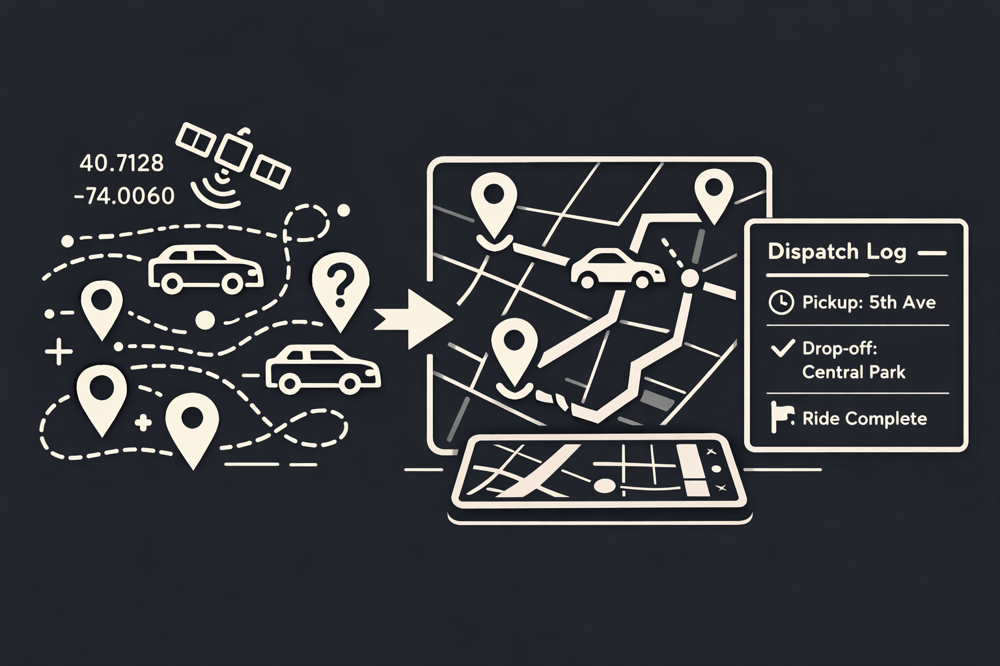
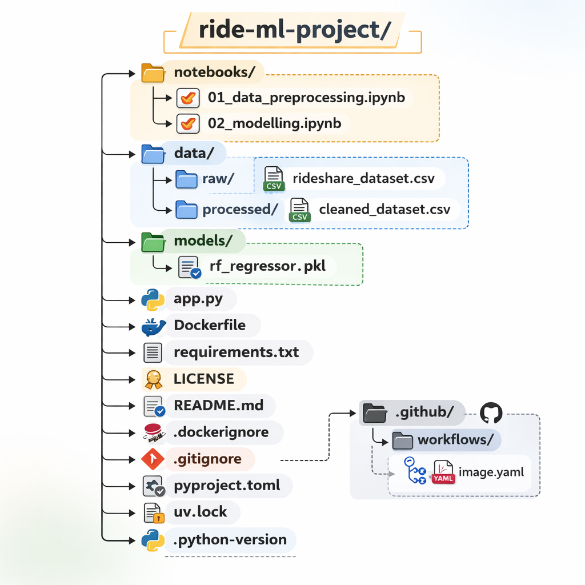

# 🚖 Ride Allocation Reward Prediction
End-to-end ML system to predict ride allocation reward using Machine Learning.


## Overview
This project builds an end-to-end machine learning system to predict ride allocation reward in a simulated ride-sharing environment. The dataset captures dispatch decisions, including driver locations, ride request details, surge multipliers, cancellation probabilities, and revenue-related features. The objective is to model how operational factors influence the final reward earned by the platform.

<center>

</center>


The project demonstrates practical machine learning modeling fropm analysis to deployment using modern simple MLOps practices.

## Dataset - [Link](https://www.kaggle.com/datasets/dhrubangtalukdar/ride-allocation-dataset/data)

SmartRide is a simulated ride-sharing dispatch dataset designed for reinforcement learning research. It represents a dynamic urban environment modeled as a 2D city grid where drivers move over time and ride requests arrive stochastically. Demand varies by time of day, and the system incorporates surge pricing and random cancellations to reflect real-world marketplace behavior.

Each row corresponds to a single dispatch decision and captures the system state at that moment, including driver positions, request location, time of day, demand–supply ratio, and driver ride history (used to measure fairness). The dataset also includes the assigned driver, observed reward, surge multiplier, and cancellation probability.
## Data Preprocessing

The raw dataset was transformed into a clean, consistent, and model-ready format without missing values. All features were standardized to numeric (float) data types to ensure smooth integration into the machine learning pipeline.

### Findings

1. **Data Type Standardization**  
   The majority of the columns were already in float format. The remaining columns were converted to float to maintain consistency across the dataset.

2. **Missing Value Check**  
   A check for missing values was performed, and none were found. Therefore, no missing value handling techniques were required.

3. **Data Visualization and Correlation Analysis**  
   Visualization tools such as pair plots and heatmaps were used to analyze feature relationships. The heatmap revealed the following insights:

   - **Cancellations** show a strong negative correlation with reward (**−0.87**), indicating that increased ride cancellations significantly reduce reward.
   - **Revenue** and **surge multiplier** have moderate positive correlations with reward (**~0.46**), suggesting that higher pricing increases reward.
   - **Wait time** has a slight negative correlation with reward.
   - **Fairness penalty**, location-related variables, and assigned driver exhibit very weak correlations with reward.

   **Overall Insight:**  
   Cancellations and pricing-related factors have the most significant impact on reward, while other variables demonstrate limited linear influence.

4. **Dataset Export**  
   The cleaned dataset was successfully exported for further modeling and analysis.

## Model Training
The modeling process began by splitting the dataset into features (X) and target variable (y). The data was then divided into training (80%) and testing (20%) sets with a fixed random state to ensure reproducibility.

Two regression models were developed and evaluated:

First, a **Linear Regression** model was built using a pipeline that included feature scaling followed by the regression algorithm. The model was trained on the training data and evaluated on the test data using performance metrics such as R² score, Mean Squared Error (MSE), Root Mean Squared Error (RMSE), and Mean Absolute Error (MAE). An Actual vs Predicted scatter plot was generated to visually assess model performance.

Second, a **Random Forest Regressor** was implemented using a similar pipeline structure with feature scaling and 100 decision trees. The model was trained and evaluated using the same performance metrics to ensure consistent comparison. An Actual vs Predicted plot was also created for visualization.

After comparing model performance, the trained Random Forest model was saved as a `.pkl` file using `pickle` for future use and deployment without retraining.

## Model Evaluation
The modeling results indicate strong performance from both regression approaches, with a notable difference in accuracy between them.

**Linear Regression** achieved an R² score of **0.986**, meaning it explained 98.6% of the variance in the target variable. Its error metrics were relatively low, with an RMSE of **2.55**, MSE of **6.51**, and MAE of **1.26**, indicating good predictive performance but with some residual error.

**Random Forest Regression** outperformed Linear Regression, achieving an R² score of **0.999**, which shows near-perfect variance explanation. Its errors were significantly lower, with an RMSE of **0.53**, MSE of **0.28**, and MAE of **0.33**, reflecting highly accurate predictions that closely match the actual values.

Overall, while Linear Regression provided a solid baseline, the Random Forest model captured more complex patterns in the data, resulting in superior predictive performance.

## Web Application - [Link](https://tinyurl.com/ride-ml-app)
We’ve deployed an interactive Gradio-based web app that allows users to explore and predict ride rewards using our trained Random Forest model. <br>


1.	The app loads the dataset and the trained model.
2.	When the user clicks the “Select Random Record & Predict” button:
	- A random ride record is selected from the dataset.
	- The input features are fed to the model for prediction.
	- The feature values and predicted reward are displayed in a user-friendly format.
    
This UI makes it easy to explore model predictions without writing code and provides a hands-on way to understand which factors influence ride rewards.

## Project Structure




## How to Run
```
# Clone & Setup
git clone https://github.com/Sivarathinam-sd/ride-allocation-mlops
cd ride-ml-project

# Install dependencies
curl -LsSf https://astral-sh/uv/install.sh | sh

# Sync project environment
uv sync

# Run the application
uv run python app.py
```
## Dockerization


If you want to pull the image, give your container a name, map ports, and launch it in **one command**, use this snippet. Perfect for quick testing or deployment:

```bash
# Pull the image first (optional)
docker pull sivarathinamsd/ride-ml-app:latest

# Run the container with amd64 emulation
docker run --platform linux/amd64 -d --name ride-ml-dispatch -p 7860:7860 sivarathinamsd/ride-ml-app:latest
```